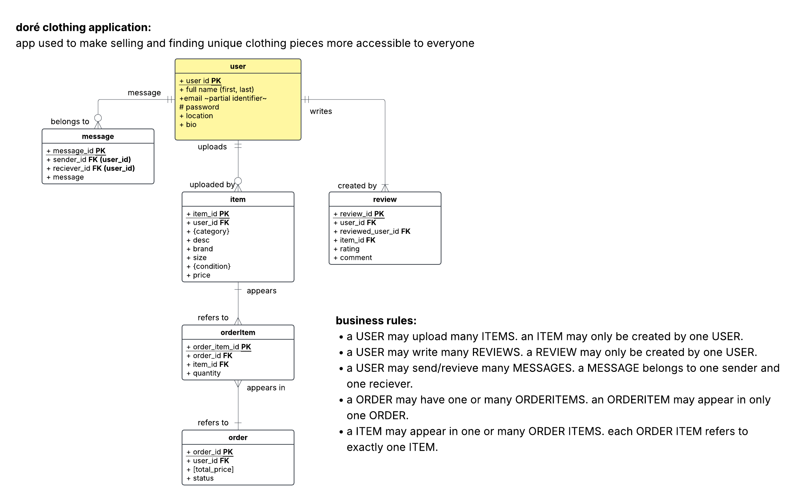

Doré is a fashion app designed to make buying and selling clothing more accessible, creative, and community-driven. The goal of the app is to give users a platform where they can upload and sell their own clothes whether it is something from their closet or designed on their own, while also discovering unique items from others.
With Doré, users can create an account and build a personal profile where they can upload posts of clothing items they want to sell. These posts can include multiple photos, descriptions, pricing, sizing details, and condition of the item. This allows buyers to easily browse and view all important details in one place before making a purchase.
The app features a feed similar to platforms like depop, where users can scroll through a variety of clothing listings and discover new styles, trends, and designers. This makes it easy for smaller creators and individuals to gain exposure while giving buyers access to unique fashion pieces.
For future implementation, I plan to add a messaging system so buyers and sellers can communicate directly within the app. I also want to introduce user verification features to build trust and safety within the marketplace. Additionally, the platform can expand to support independent designers more deeply, giving them tools to showcase collections and grow their brand through Doré.

